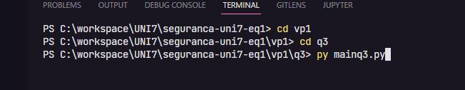

# How to run

- I faced some problems with q3 folder path, but i resolved.
- I was running mainq3.py file with play button inside vscode, but the right way to do that is using terminal.
- In the terminal you need to specify the path of question 3, that is, if you are in the path <span style='color: red'>c:\xxx\xxx\seguranca-uni7-eq1\ </span> you need to insert the following commands:

```
cd vp1
```
- After that
```
cd q3
```
- And then run the command

```
py index.py
```

## Example that you can follow:
#


# Method helpers

## hashlib.sha256()
- creates a SHA-256 hash object

## hashlib.sha512()
- creates a SHA-512 hash object

## hashlib.MD5()
- creates a MD5 hash object which has a hash value of 128 bits

## update()
- Once you create a hash object you can feed this object with [bytes-like-object](https://docs.python.org/3/glossary.html#term-bytes-like-object) using the update() method.

## encode()
- Encode the string using the codec registered for encoding.

## hexdigest()
 - returns string object containing only hexadecimal digits.

## [Python hashlib documentation](https://docs.python.org/3/library/hashlib.html)
 

